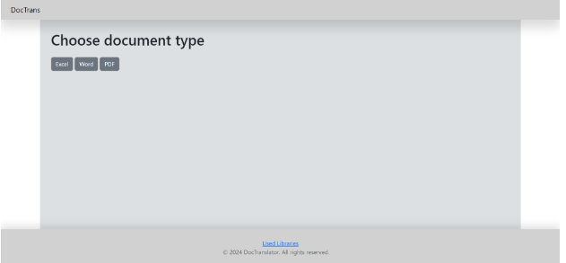

###Project Description "DocTrans"

###Introduction

The "DocTrans" project is a web application developed with *Django*, designed to translate the content of documents, such as Excel, Word, PDF files, using the *deep\_translator* library. The application provides a user-friendly interface for uploading documents, selecting translation languages, and receiving translated files.

**Used Libraries**

Various libraries are used in the project, but the most important ones are:

- **Django**: A Python web framework that provides the backend, URL routing, database handling, and template rendering.
- **deep\_translator**: A library for translating text using various APIs.
- **docx**: Python library for creating and updating Microsoft Word (.docx) files.
- **pdf2docx**: Open source Python library converting pdf to docx.

**Project Structure**
## **Main Project Directory**
- *settings.py:* Configuration settings for the *Django* project, including database, static files, and Celery integration.
- *urls.py:* URL routing configuration.
- *wsgi.py:* Entry point for WSGI-compatible web servers.
## **Application**
- *views.py:* Handles file upload, translation logic, and rendering responses.
- *forms.py:* Defines forms for language selection.
- *file\_translator.py:* Contains the Translator class for translating files.
## **Templates**
- *base.html:* Base template for other pages.
- *error\_message.*html: Template for the “error” page.
- *excel\_translator.html:* Template for excel file upload and translation interface.
- *word\_translator.*html: Template for word file upload and translation interface.
- *pdf\_translator.*html: Template for PDF file upload and translation interface.
- *index.html:* Template for the homepage.

**Media Files**

- *media/:* Stores uploaded user files and translated documents.’

**Static Files**

- static/css/: Stores styles for html pages.
- static/js/: Stores JavaScript scripts for html pages.

**Workflow**

1. **File Upload**: Users upload a file through the web interface.
1. **Language Selection**: Users select source and target languages.
1. **Translation**: The content of a file is translated using *GoogleTranslator*. A translated file is created and uploaded to the server.
1. **Download**: Users download the translated file.

**Homepage:**

**Translation Page:**

**Hosting and Deployment**

The application is built using the Django framework and deployed on a *DigitalOcean* droplet (Ubuntu), with server configuration handled by Nginx.

**Development Stage and Plans**

At the moment, only a translator for Excel files is completed and a translator for Word files is being developed. In the future, it is planned to create a translator for *PowerPoint, PDF, SRT* and other files. Moreover, the design will be improved to make it easy to understand for a user. 

*Web application link: <http://142.93.170.140/>* 

*Developed by Tomass Krauklis*
